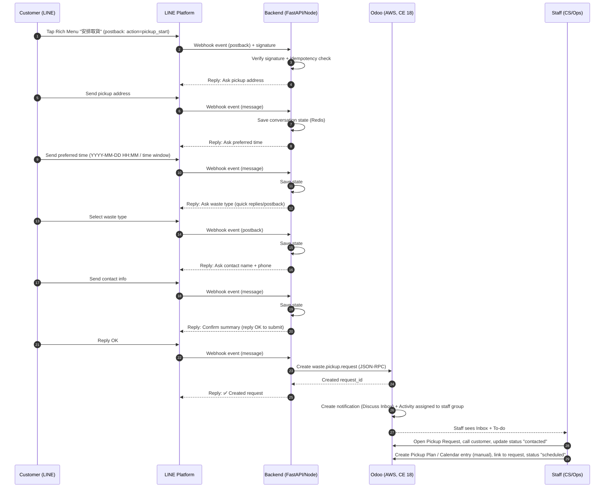

# Sequence Diagram – LINE「安排取貨」→ Odoo 通知 + 取貨需求單

```mermaid
sequenceDiagram
  autonumber
  participant C as Customer (LINE)
  participant L as LINE Platform
  participant B as Backend (FastAPI/Node)
  participant O as Odoo (AWS, CE 18)
  participant S as Staff (CS/Ops)

  C->>L: Tap Rich Menu "安排取貨" (postback: action=pickup_start)
  L->>B: Webhook event (postback) + signature
  B->>B: Verify signature + idempotency check
  B-->>L: Reply: Ask pickup address

  C->>L: Send pickup address
  L->>B: Webhook event (message)
  B->>B: Save conversation state (Redis)
  B-->>L: Reply: Ask preferred time

  C->>L: Send preferred time (YYYY-MM-DD HH:MM / time window)
  L->>B: Webhook event (message)
  B->>B: Save state
  B-->>L: Reply: Ask waste type (quick replies/postback)

  C->>L: Select waste type
  L->>B: Webhook event (postback)
  B->>B: Save state
  B-->>L: Reply: Ask contact name + phone

  C->>L: Send contact info
  L->>B: Webhook event (message)
  B->>B: Save state
  B-->>L: Reply: Confirm summary (reply OK to submit)

  C->>L: Reply OK
  L->>B: Webhook event (message)
  B->>O: Create waste.pickup.request (JSON-RPC)
  O-->>B: Created request_id
  B-->>L: Reply: ✅ Created request #ID

  O->>O: Create notification (Discuss Inbox) + Activity assigned to staff group
  O-->>S: Staff sees Inbox + To-do
  S->>O: Open Pickup Request, call customer, update status "contacted"
  S->>O: Create Pickup Plan / Calendar entry (manual), link to request, status "scheduled"
```
